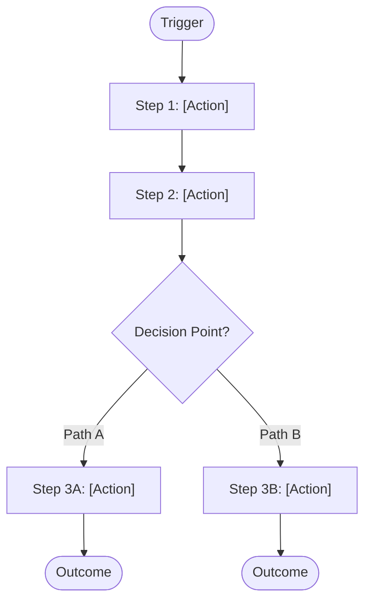
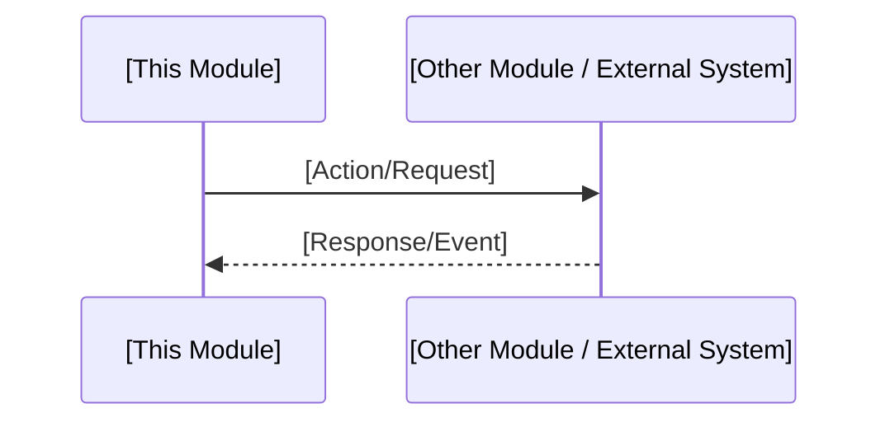

# Module Flow: [MODULE NAME]

**Back to**: [00-overview.md](../../00-overview.md) · [brd.md](brd.md)
**Last Updated**: [DATE]

<!--
  ACTION REQUIRED: One section per major business process reconstructed from
  this module's entry points (routes/controllers/CLI/UI) and the code paths
  they trigger. Omit a process's section entirely if no flow is discernible
  for it - do not invent steps to fill the template.
-->

## [Primary Process Name]

[1-2 sentence description of when/why this process runs.]

<!-- Repeat the section above for each additional major process in this module. -->

## Integration Flows

<!--
  ACTION REQUIRED: Only include this section if this module talks to other
  modules or external systems as part of a process (not just a static
  dependency - that belongs in technical.md). Omit entirely if this module
  has no cross-boundary flow worth diagramming.
-->

