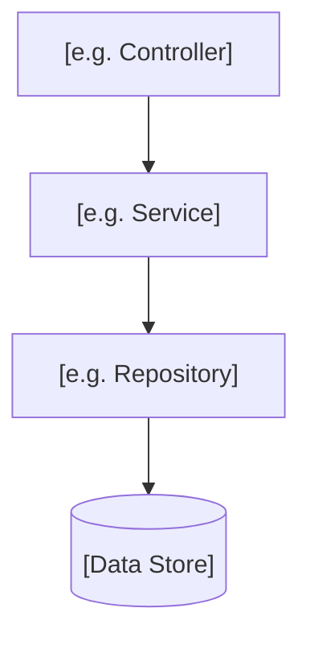

# Module Technical: [MODULE NAME]

**Back to**: [00-overview.md](../../00-overview.md) · [brd.md](brd.md) · [flow.md](flow.md)
**Last Updated**: [DATE]

<!--
  Ordered low-level -> high-level per explicit user request: start at the
  concrete implementation and build up to the module's role in the system.
-->

## Low-Level

<!--
  ACTION REQUIRED: Key files/classes that implement this module, and its data
  model/schema - tables, fields, notable constraints (unique/foreign
  key/enum), as actually defined in migrations/models, not paraphrased.
-->

- **Key files/classes**: [`path/to/file.ext`](path/to/file.ext) - [what it does]
- **Data model/schema**:
  - `[table_or_collection]`: [fields, types, notable constraints]
- **Test coverage**: [Test files found for this module, e.g. `order.test.ts` covering `OrderService`, or "No test files found for this module" if none exist - this is what a revamp should treat as "risky to touch without writing tests first"]

## Mid-Level

<!--
  ACTION REQUIRED: This module's internal architecture - the layering or
  pattern used (e.g. controller-service-repository, MVC, event-driven state
  machine), and how the pieces in Low-Level compose into it.
-->

[Internal architecture/pattern in 2-4 sentences, naming the layers involved.]

## High-Level

<!--
  ACTION REQUIRED: This module's role in the system as a whole - what it
  exposes/consumes, and what it depends on.
-->

- **APIs exposed**: [Endpoint/interface] - [purpose]
- **APIs consumed**: [Endpoint/interface] - [purpose]
- **Events published**: [Event name] - [when/why]
- **Events subscribed**: [Event name] - [what it triggers here]
- **Dependencies on other modules**: [Module] - [what's used from it]
- **External integrations**: [Third-party service/API] - [purpose]
- **Module-specific tech stack**: [Framework/library/DB unique to this module, if any - with its version as pinned in the manifest, e.g. "django==3.2.4"]

## Known Technical Debt / Risks

<!--
  ACTION REQUIRED: Evidence-based only - TODOs, deprecated code, stubs,
  commented-out blocks. Do not speculate about risks the code doesn't show.
-->

- [Observed debt/risk, with file reference]

## Change Log

<!--
  Maintained by /rudis.brd on each re-run that touches this module.
  Prepend newest entry first. Independent from other modules' update cadence.
-->

- **[DATE]**: Initial version generated from codebase survey.
