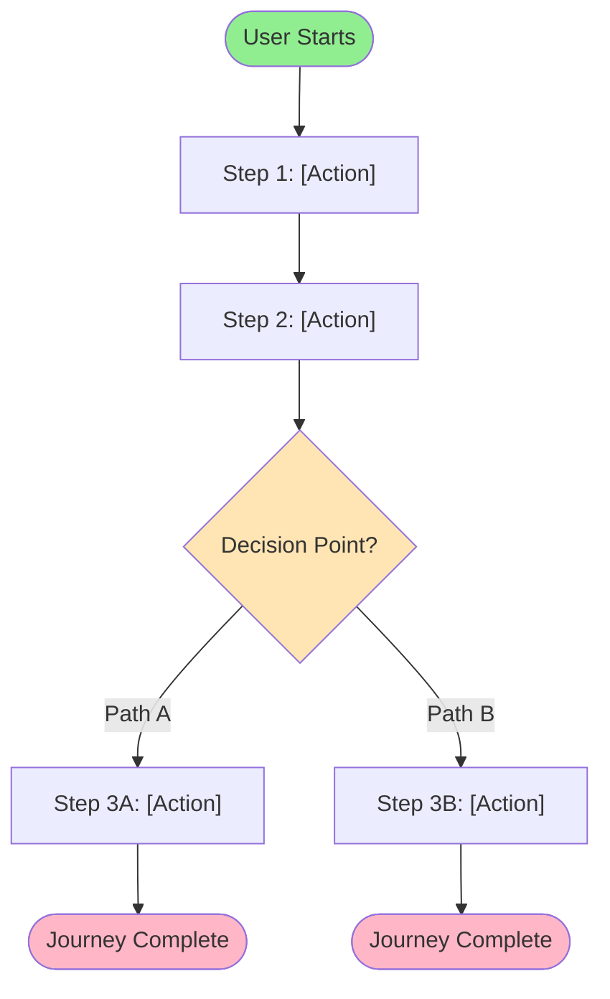
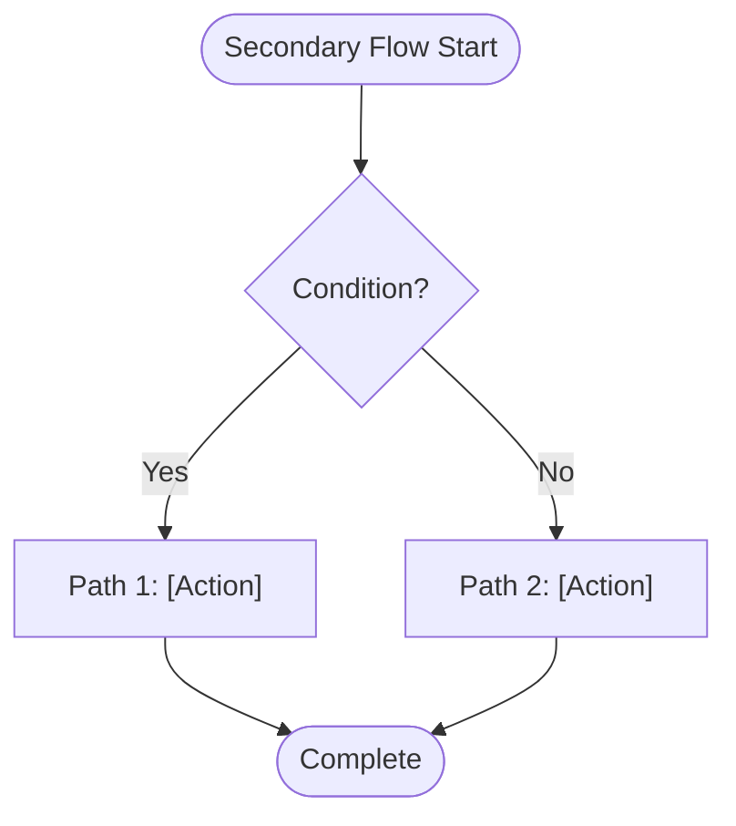

# Feature Specification: [FEATURE NAME]

**Feature Branch**: `[###-feature-name]`  
**Created**: [DATE]  
**Status**: Draft  
**Input**: User description: "$ARGUMENTS"

## User Scenarios & Testing *(mandatory)*

<!--
  IMPORTANT: User stories should be PRIORITIZED as user journeys ordered by importance.
  Each user story/journey must be INDEPENDENTLY TESTABLE - meaning if you implement just ONE of them,
  you should still have a viable MVP (Minimum Viable Product) that delivers value.
  
  Assign priorities (P1, P2, P3, etc.) to each story, where P1 is the most critical.
  Think of each story as a standalone slice of functionality that can be:
  - Developed independently
  - Tested independently
  - Deployed independently
  - Demonstrated to users independently
-->

### User Story 1 - [Brief Title] (Priority: P1)

[Describe this user journey in plain language]

**Why this priority**: [Explain the value and why it has this priority level]

**Independent Test**: [Describe how this can be tested independently - e.g., "Can be fully tested by [specific action] and delivers [specific value]"]

**Acceptance Scenarios**:

1. **Given** [initial state], **When** [action], **Then** [expected outcome]
2. **Given** [initial state], **When** [action], **Then** [expected outcome]

---

### User Story 2 - [Brief Title] (Priority: P2)

[Describe this user journey in plain language]

**Why this priority**: [Explain the value and why it has this priority level]

**Independent Test**: [Describe how this can be tested independently]

**Acceptance Scenarios**:

1. **Given** [initial state], **When** [action], **Then** [expected outcome]

---

### User Story 3 - [Brief Title] (Priority: P3)

[Describe this user journey in plain language]

**Why this priority**: [Explain the value and why it has this priority level]

**Independent Test**: [Describe how this can be tested independently]

**Acceptance Scenarios**:

1. **Given** [initial state], **When** [action], **Then** [expected outcome]

---

[Add more user stories as needed, each with an assigned priority]

### Edge Cases

<!--
  ACTION REQUIRED: The content in this section represents placeholders.
  Fill them out with the right edge cases.
-->

- What happens when [boundary condition]?
- How does system handle [error scenario]?

## Requirements *(mandatory)*

<!--
  ACTION REQUIRED: The content in this section represents placeholders.
  Fill them out with the right functional requirements.
-->

### Functional Requirements

- **FR-001**: System MUST [specific capability, e.g., "allow users to create accounts"]
- **FR-002**: System MUST [specific capability, e.g., "validate email addresses"]  
- **FR-003**: Users MUST be able to [key interaction, e.g., "reset their password"]
- **FR-004**: System MUST [data requirement, e.g., "persist user preferences"]
- **FR-005**: System MUST [behavior, e.g., "log all security events"]

*Example of marking unclear requirements:*

- **FR-006**: System MUST authenticate users via [NEEDS CLARIFICATION: auth method not specified - email/password, SSO, OAuth?]
- **FR-007**: System MUST retain user data for [NEEDS CLARIFICATION: retention period not specified]

### Key Entities *(include if feature involves data)*

<!--
  Capture the domain model faithfully — this is what /rudis.plan normalizes into the
  database schema, so it keeps the DB aligned with the source. Stay at the DOMAIN level
  (no tables, columns, types, or storage decisions). When the feature is based on a
  source document (e.g. a TMF API user guide), mirror its resource model here. For each
  entity capture: key attributes, sub-entities/collections it owns, its state lifecycle
  (allowed states + transitions), and its relationships to other entities.
-->

- **[Entity 1]**: [What it represents]
  - Key attributes: [attribute, attribute, …]
  - Owns / contains: [sub-entities or collections, e.g. "one or more Cost Items"]
  - State lifecycle: [allowed states and transitions, if any]
  - Relationships: [how it relates to other entities]
- **[Entity 2]**: [What it represents — repeat the same sub-points as above]

## Success Criteria *(mandatory)*

<!--
  ACTION REQUIRED: Define measurable success criteria.
  These must be technology-agnostic and measurable.
-->

### Measurable Outcomes

- **SC-001**: [Measurable metric, e.g., "Users can complete account creation in under 2 minutes"]
- **SC-002**: [Measurable metric, e.g., "System handles 1000 concurrent users without degradation"]
- **SC-003**: [User satisfaction metric, e.g., "90% of users successfully complete primary task on first attempt"]
- **SC-004**: [Business metric, e.g., "Reduce support tickets related to [X] by 50%"]

## Business Process Flow *(visual aid)*

<!--
  ACTION REQUIRED: Create a business process diagram showing the main flow(s)
  This helps stakeholders understand the workflow at a glance.
  Use Mermaid flowchart syntax below.
-->

### Primary User Journey Flow

### Alternative/Secondary Flows

<!--
  Optional: Add additional business process flows for alternate scenarios or edge cases
-->

## Business Actors & Interactions

<!--
  ACTION REQUIRED: Map out the different user roles/actors and their interactions
  Use a simple table to show who does what
-->

| Actor | Role | Key Interactions |
| ----- | ---- | ---------------- |
| [Actor 1] | [Role Description] | [Main actions they perform] |
| [Actor 2] | [Role Description] | [Main actions they perform] |
| [System] | [System Role] | [Automated responses/actions] |
