# Data Model & Schema Design: AG School Finance (JSON File Storage)

**Feature**: `001-srs-ag-school-finance`  
**Date**: 2026-07-24  

## Overview

This document specifies the JSON file structures and repository access layer for AG School Finance. Data is stored in structured JSON files under `backend/data/`. All operations are managed via the Repository Pattern to support future database migrations without modifying business logic.

---

## JSON Data Files & Entities

| JSON File Path | Primary Entity | Access Control | Purpose |
| -------------- | -------------- | -------------- | ------- |
| `backend/data/roles.json` | Role | Internal | Configurable RBAC roles (Admin, Finance, Secretary) |
| `backend/data/users.json` | User Account | Internal | Authenticated system accounts & password hashes |
| `backend/data/members.json` | Member | Internal | Internal school members receiving payouts |
| `backend/data/incomes.json` | Income | Internal / Confidential | Income records & sources |
| `backend/data/expenses.json` | Expense | Internal / Confidential | Operational expenses & optional event links |
| `backend/data/payments.json` | Internal Payment | Internal / Confidential | Payouts to members (BA, Caster, Maintainer, etc.) |
| `backend/data/events.json` | Event | Public / Internal | Event details, status, posters, prize pool |
| `backend/data/prizes.json` | Prize | Public / Internal | Event prizes, winners, public payment status |
| `backend/data/event_standings.json` | Event Standings | Public / Internal | League points matrix, match placements, tie-breaker calculation |
| `backend/data/logs.json` | Activity Log | Admin Only | Security audit logs |
| `backend/data/settings.json` | System Setting | Admin Only | Exchange rates (SGD/IDR), organization profile |

---

## Entity Relationship Diagram (Conceptual Domain Model)

```mermaid
erDiagram
    ROLES ||--o{ USERS : assigns
    USERS ||--o{ INCOMES : records
    USERS ||--o{ EXPENSES : records
    USERS ||--o{ PAYMENTS : records
    USERS ||--o{ EVENTS : creates
    USERS ||--o{ LOGS : performs
    
    MEMBERS ||--o{ PAYMENTS : receives
    EVENTS ||--o{ EXPENSES : links
    EVENTS ||--o{ PRIZES : awards

    USERS {
        int id
        string username
        string email
        string password_hash
        int role_id
        string status
    }

    MEMBERS {
        int id
        string full_name
        string category
        string status
    }

    INCOMES {
        int id
        string transaction_date
        string category
        number amount
        string currency
    }

    EXPENSES {
        int id
        string transaction_date
        string category
        number amount
        string currency
        int related_event_id
    }

    PAYMENTS {
        int id
        int member_id
        string payment_category
        number amount
        string status
    }

    EVENTS {
        int id
        string title
        string poster_url
        string event_status
    }

    PRIZES {
        int id
        int event_id
        string prize_title
        string winner_name
        string payment_status
    }
```



---

## JSON Structure Definitions

### 1. `backend/data/users.json`
```json
[
  {
    "id": 1,
    "username": "admin",
    "email": "admin@agschool.com",
    "full_name": "System Administrator",
    "password_hash": "$2b$10$...",
    "role_id": 1,
    "status": "active",
    "last_login_at": "2026-07-24T10:00:00.000Z",
    "created_at": "2026-07-24T00:00:00.000Z",
    "updated_at": "2026-07-24T00:00:00.000Z",
    "deleted_at": null
  }
]
```

### 2. `backend/data/events.json`
```json
[
  {
    "id": 1,
    "title": "AG School Valorant Cup 2026",
    "description": "Annual community tournament.",
    "poster_url": "/uploads/posters/poster_valorant_2026.jpg",
    "event_type": "Tournament",
    "start_date": "2026-08-01",
    "end_date": "2026-08-03",
    "registration_status": "Closed",
    "event_status": "Completed",
    "total_prize_pool": 1500.00,
    "created_by_user_id": 1,
    "created_at": "2026-07-24T00:00:00.000Z",
    "updated_at": "2026-07-24T00:00:00.000Z",
    "deleted_at": null
  }
]
```

### 3. `backend/data/prizes.json`
```json
[
  {
    "id": 1,
    "event_id": 1,
    "prize_title": "Champion",
    "winner_name": "Team Nova",
    "reward_description": "SGD 1,000 + Trophy",
    "payment_status": "Paid",
    "payment_date": "2026-08-04",
    "internal_notes": "Paid via bank transfer.",
    "created_at": "2026-07-24T00:00:00.000Z",
    "updated_at": "2026-07-24T00:00:00.000Z",
    "deleted_at": null
  }
]
```

### 4. `backend/data/incomes.json`
```json
[
  {
    "id": 1,
    "transaction_date": "2026-07-20",
    "category": "Sponsorship",
    "source": "Tech Brand X",
    "description": "Event Sponsorship Title Partner",
    "amount": 2500.00,
    "currency": "SGD",
    "notes": "Sponsorship agreement signed.",
    "recorded_by_user_id": 1,
    "created_at": "2026-07-20T10:00:00.000Z",
    "updated_at": "2026-07-20T10:00:00.000Z",
    "deleted_at": null
  }
]
```

### 5. `backend/data/expenses.json`
```json
[
  {
    "id": 1,
    "transaction_date": "2026-07-21",
    "category": "Logistics",
    "description": "Venue Booking & Stage Setup",
    "amount": 800.00,
    "currency": "SGD",
    "related_event_id": 1,
    "notes": "Stage rental invoice #1042.",
    "recorded_by_user_id": 1,
    "created_at": "2026-07-21T11:00:00.000Z",
    "updated_at": "2026-07-21T11:00:00.000Z",
    "deleted_at": null
  }
]
```

### 6. `backend/data/payments.json`
```json
[
  {
    "id": 1,
    "member_id": 2,
    "payment_category": "Caster payment",
    "amount": 300.00,
    "currency": "SGD",
    "status": "Paid",
    "payment_date": "2026-08-04",
    "notes": "Casting fee for Valorant finals.",
    "recorded_by_user_id": 1,
    "created_at": "2026-08-04T15:00:00.000Z",
    "updated_at": "2026-08-04T15:00:00.000Z",
    "deleted_at": null
  }
]
```

### 7. `backend/data/members.json`
```json
[
  {
    "id": 4,
    "full_name": "Kang Iqbal",
    "email": "iqbal@agschool.com",
    "phone": "081234567890",
    "roblox_username": "mizulqarnaen",
    "roblox_nickname": "KangIqbalFALL_MKJZT",
    "tiktok_handle": "@mizulqarnaen",
    "discord_username": "@kangiqbal_dc",
    "bank_name": "BCA",
    "bank_account_number": "8830192831",
    "bank_account_name": "Iqbal Mizulqarnaen",
    "category": "Caster, Content Creator",
    "categories": ["Caster", "Content Creator"],
    "role_salaries": {
      "Caster": { "amount": 500000, "currency": "IDR" },
      "Content Creator": { "amount": 700000, "currency": "IDR" }
    },
    "monthly_salary": 1200000,
    "salary_currency": "IDR",
    "status": "active",
    "joined_date": "2026-07-24",
    "created_at": "2026-07-24T04:41:46.053Z",
    "updated_at": "2026-07-27T06:24:00.000Z",
    "deleted_at": null
  }
]
```

### 7. `backend/data/settings.json`
```json
{
  "org_name": "AG School",
  "contact_email": "contact@agschool.com",
  "exchange_rate_sgd_idr": 11800.00,
  "default_currency": "SGD",
  "updated_at": "2026-07-24T00:00:00.000Z"
}
```

---

## Repository Abstraction Layer (Data Access Interface)

To ensure future database compatibility, all database CRUD operations are accessed via asynchronous Repository classes:
- `BaseJsonRepository<T>`: Handles atomic reading, writing, locking, pagination, and soft-deletes.
- `UserRepository`, `IncomeRepository`, `ExpenseRepository`, `PaymentRepository`, `EventRepository`, `PrizeRepository`, `MemberRepository`, `ActivityLogRepository`.
