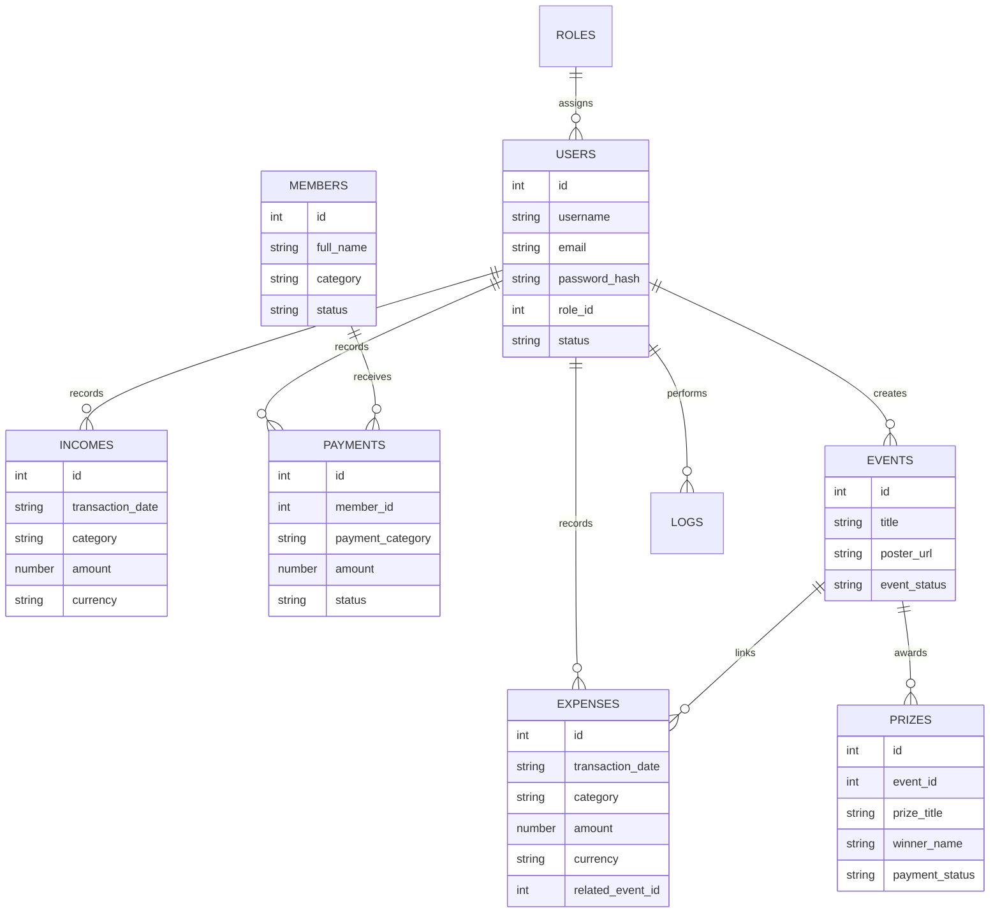
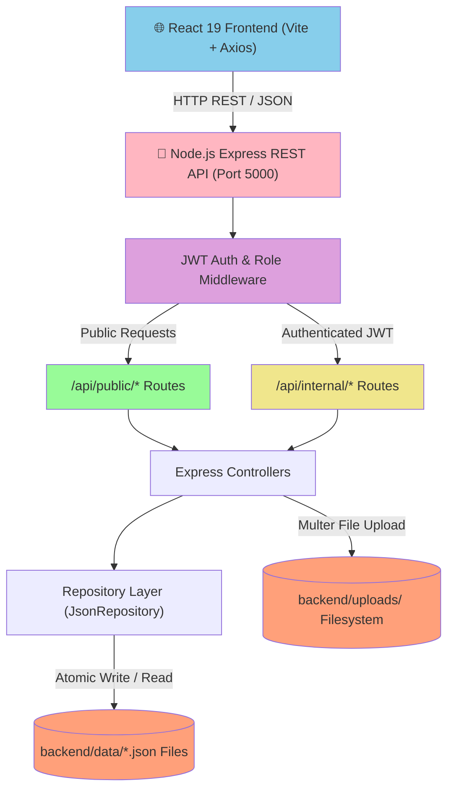
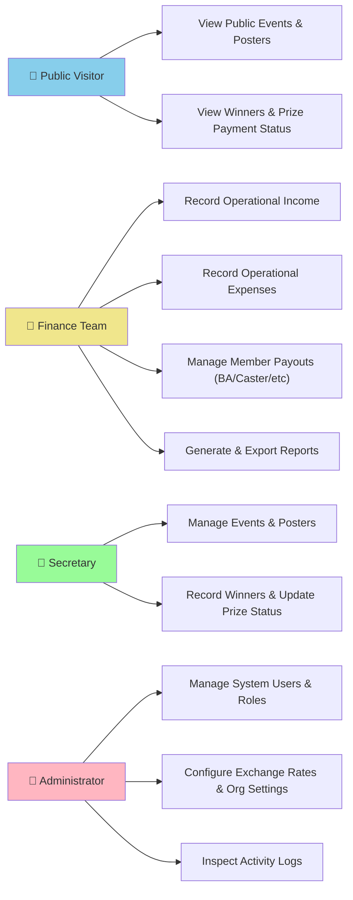

# Implementation Plan: AG School Finance

**Branch**: `001-srs-ag-school-finance` | **Date**: 2026-07-24 | **Spec**: [spec.md](file:///c:/laragon/www/agschool/specs/001-srs-ag-school-finance/spec.md)  
**Input**: Feature specification from `/specs/001-srs-ag-school-finance/spec.md` and mandated technology stack rules.

## Summary

AG School Finance is a decoupled two-tier web application consisting of a React 19 (Vite + Tailwind CSS) frontend SPA and a Node.js (Express) REST API backend. It provides an internal authenticated portal for school operational finances (income, expenses, member payouts, events, reporting) and an unauthenticated public portal for event transparency (posters, winners, prize payment status). Primary storage uses structured JSON files (`backend/data/*.json`) managed via the Repository Pattern to support future database migrations without altering business logic.

## Technical Context

**Language/Version**: JavaScript (ES6+ / Node.js LTS)  
**Frontend Stack**: React 19, Vite, Tailwind CSS, React Router v6+, Axios, Lucide React, Chart.js (react-chartjs-2), React Hot Toast  
**Backend Stack**: Node.js (LTS), Express.js, JWT (jsonwebtoken), bcrypt, Multer, Express Validator  
**Storage**: Primary Storage: Structured JSON Files (`backend/data/*.json`). Uploaded Assets: Server filesystem (`backend/uploads/`). Strictly NO SQLite, MySQL, PostgreSQL, MongoDB, Firebase, or Supabase.  
**Testing**: Jest / Supertest (Backend API integration) & Vitest / React Testing Library (Frontend)  
**Target Platform**: Node.js runtime environment  
**Project Type**: Decoupled Web Application (`frontend/` and `backend/`)  
**Architecture Type**: Independent React SPA + Express REST API  
**Integration Target**: REST API endpoints over HTTP (`http://localhost:5000/api`)  
**Existing Design System**: Custom Tailwind CSS design system with reusable components (Tables, Forms, Modals, Cards, Widgets)  
**Performance Goals**: Public pages < 2.0s load time, internal dashboard < 1.5s, API endpoints < 100ms  
**Constraints**: JSON storage only; strict public vs internal API authorization boundaries; zero exposure of confidential financial data to unauthenticated visitors  
**Scale/Scope**: ~50k historical records, 500 events, 100 concurrent public visitors  

## Constitution Check

*GATE: Must pass before Phase 0 research. Re-check after Phase 1 design.*

- **Principle I (Simplicity)**: PASSED — Modular structure, zero unauthorized external cloud/database dependencies.
- **Principle II (Modular Architecture)**: PASSED — `frontend/` and `backend/` separated cleanly; Repository Pattern isolates JSON data access.
- **Principle III & IV (Privacy & Separation)**: PASSED — JWT authentication and role-based Express middleware prevent unauthenticated access to internal endpoints; public APIs omit financial data.
- **Principle V (Controlled Transparency)**: PASSED — Public endpoints expose only event details, posters, winner lists, and prize payment statuses.
- **Principle VI (Consistent UX & Clean Code)**: PASSED — Reusable Tailwind CSS UI components (Tables, Modals, Forms, Buttons, Widgets).
- **Principle VII (Technology Stack Compliance)**: PASSED — Strictly adheres to React 19, Vite, Tailwind CSS, Node.js, Express, JWT, bcrypt, Multer, Express Validator, and JSON File Storage.

## Project Structure

### Documentation (this feature)

```text
specs/001-srs-ag-school-finance/
├── plan.md              # This file
├── research.md          # Phase 0 research & technology stack decisions
├── data-model.md        # Phase 1 JSON schema design & repository layer
├── quickstart.md        # Phase 1 local setup & launch guide
├── contracts/
│   └── api-spec.yaml    # Phase 1 OpenAPI REST specification
└── checklists/
    └── requirements.md  # Specification quality checklist
```

### Source Code (repository root)

```text
c:/laragon/www/agschool/
├── backend/
│   ├── data/            # JSON storage files (users.json, incomes.json, etc.)
│   ├── uploads/         # Server filesystem upload storage (posters, proofs)
│   ├── src/
│   │   ├── controllers/ # Auth, Income, Expense, Payment, Event, Prize, Report, Settings
│   │   ├── middleware/  # AuthMiddleware (JWT), RoleMiddleware, ValidationMiddleware
│   │   ├── repositories/# JsonRepository base, UserRepository, IncomeRepository, etc.
│   │   ├── services/    # LoggerService, ExportService, CurrencyService
│   │   └── routes/      # Express API route modules (/public, /auth, /internal)
│   ├── package.json
│   └── server.js        # Express app entry point
└── frontend/
    ├── public/          # Static assets & favicons
    ├── src/
    │   ├── components/  # Reusable UI (Table, Modal, Form, Button, Card, Navbar)
    │   ├── pages/       # PublicPortal, InternalDashboard, IncomePage, EventPage, etc.
    │   ├── services/    # Axios instance, apiService, authService
    │   ├── context/     # AuthContext
    │   ├── App.jsx      # React Router config
    │   └── main.jsx     # Vite React entry point
    ├── index.html
    ├── package.json
    ├── vite.config.js
    └── tailwind.config.js
```

**Structure Decision**: Decoupled Web Application with `frontend/` (React 19 Vite SPA) and `backend/` (Express REST API with JSON storage).

## Complexity Tracking

*No constitution violations.*

---

## Technical Diagrams

### Data Design Decisions

| Entity | JSON Storage File | Data Access Pattern | Rationale |
| ------ | ----------------- | ------------------- | --------- |
| User Account | `backend/data/users.json` | `UserRepository` | Stores users & bcrypt password hashes |
| Role | `backend/data/roles.json` | `RoleRepository` | Configurable RBAC roles |
| Member | `backend/data/members.json` | `MemberRepository` | Internal school members receiving payouts |
| Income | `backend/data/incomes.json` | `IncomeRepository` | Internal operational income records |
| Expense | `backend/data/expenses.json` | `ExpenseRepository` | Operational expenses & event links |
| Internal Payment | `backend/data/payments.json` | `PaymentRepository` | Confidential payouts to members |
| Event | `backend/data/events.json` | `EventRepository` | Event info, posters, prize pool |
| Prize | `backend/data/prizes.json` | `PrizeRepository` | Prize tiers, winners, payment status |
| Activity Log | `backend/data/logs.json` | `LogRepository` | Security & operation audit logs |
| System Setting | `backend/data/settings.json` | `SettingRepository` | Exchange rates & organization profile |

### Data Model (Entity Relationship Diagram)



### System Architecture



### Use Case Diagram



### API Contract Overview

| Operation | Endpoint | Method | Purpose | Access |
| --------- | -------- | ------ | ------- | ------ |
| Public Events | `/api/public/events` | GET | List public events & posters | Public |
| Public Event Detail | `/api/public/events/:id` | GET | Event details, winners, prize statuses | Public |
| Login | `/api/auth/login` | POST | User authentication (issues JWT) | Public |
| Logout | `/api/auth/logout` | POST | Logout user | Authenticated |
| Dashboard | `/api/internal/dashboard` | GET | Financial summary metrics | Authenticated |
| Income CRUD | `/api/internal/incomes` | GET/POST/PUT/DELETE | Manage income entries | Finance, Admin |
| Expense CRUD | `/api/internal/expenses` | GET/POST/PUT/DELETE | Manage operational expenses | Finance, Admin |
| Internal Payments | `/api/internal/payments` | GET/POST/PUT/DELETE | Manage member payouts | Finance, Admin |
| Event Management | `/api/internal/events` | GET/POST/PUT/DELETE | Manage events & prize tiers | Secretary, Admin |
| Poster Upload | `/api/internal/events/:id/poster` | POST | Upload poster file via Multer | Secretary, Admin |
| Reports & Export | `/api/internal/reports/export` | GET | Export CSV/Excel financial reports | Finance, Admin |
