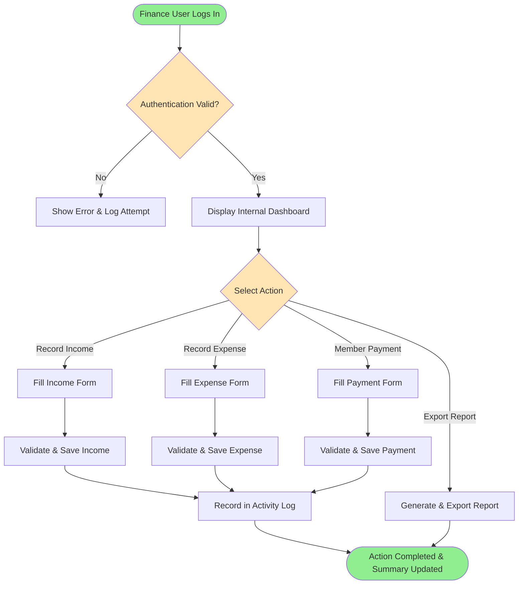
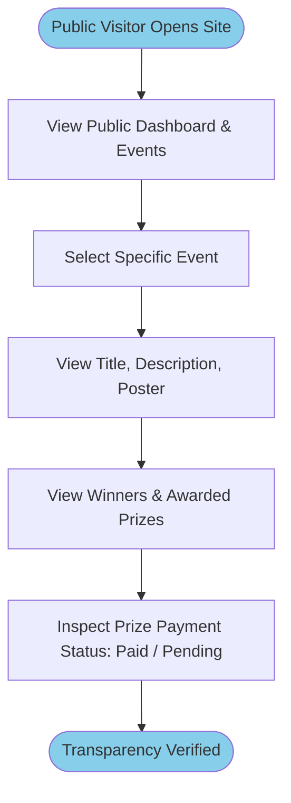

# Feature Specification: AG School Finance SRS

**Feature Branch**: `001-srs-ag-school-finance`  
**Created**: 2026-07-24  
**Status**: Draft  
**Input**: Comprehensive Software Requirements Specification (SRS) for AG School Finance project based on approved Constitution.

---

## Project Overview

AG School Finance is a lightweight web application designed to manage the operational finances of AG School while providing a public transparency portal for event-related information. 

The system serves two distinct audiences and areas:
1. **Internal Management Portal (Authenticated)**: Enables authorized school administrators, finance team members, and secretaries to manage operational finances, record income/expenses, manage internal member payments, organize events, track prize distributions, generate financial reports, export financial data, and maintain historical records securely.
2. **Public Transparency Portal (Unauthenticated)**: Allows public visitors and community members to view public event information, event posters, event winners, and prize distribution payment status without exposing confidential financial records or operational expenses.

---

## User Scenarios & Testing

### User Story 1 - Public Visitor Views Event Transparency (Priority: P1)
As an unauthenticated Public Visitor, I want to browse community events, view event posters, inspect winner lists, and check whether event prizes have been paid, so that I can verify event transparency without accessing confidential school finances.

**Why this priority**: Core purpose of public transparency; zero authentication requirement makes it the baseline entry point.

**Independent Test**: Can be tested independently by navigating to the public portal without logging in and verifying that all event details, posters, winner lists, and prize payment statuses are visible while internal financial navigation is completely inaccessible.

**Acceptance Scenarios**:
1. **Given** an unauthenticated visitor on the homepage, **When** they view the public event list, **Then** they see upcoming and past public events with titles, dates, descriptions, posters, and prize payment statuses.
2. **Given** an unauthenticated visitor, **When** they attempt to access internal URLs (e.g., `/income`, `/expenses`, `/members`, `/reports`), **Then** the system redirects them to the login page or displays a 403 Forbidden page.

---

### User Story 2 - Finance Team Records Income & Operational Expenses (Priority: P1)
As a Finance Team member, I want to record income and operational expense transactions with dates, categories, amounts, and optional event links, so that internal operational finances are accurately tracked and reported.

**Why this priority**: Core primary requirement for internal financial management and operational accounting.

**Independent Test**: Can be tested independently by logging in as a Finance user, creating income and expense entries, updating them, filtering by category/date, and verifying totals in the internal dashboard.

**Acceptance Scenarios**:
1. **Given** an authenticated Finance user on the Expense entry page, **When** they submit a valid expense with date, category, description, amount, and optional event link, **Then** the expense is recorded, updated in internal financial summaries, and logged in the Activity Log.
2. **Given** a recorded expense, **When** a Public Visitor views the event details page linked to that expense, **Then** the operational expense details are NOT displayed to the public visitor.

---

### User Story 3 - Secretary Manages Event & Prize Distribution (Priority: P2)
As a Secretary, I want to create events, upload promotional posters, define prize tiers, record event winners, and update prize payment statuses, so that event management and prize distributions are organized and reflected on the public transparency portal.

**Why this priority**: Connects internal event management to public transparency and prize distribution tracking.

**Independent Test**: Can be tested independently by creating an event, uploading a poster, adding winners/prizes, marking a prize as "Paid", and verifying that the updated status immediately reflects on the Public Transparency Portal.

**Acceptance Scenarios**:
1. **Given** an authenticated Secretary on the Event Management page, **When** they add a prize winner and mark the prize payment status as "Paid" with a payment date, **Then** the prize status updates internally and becomes visible on the public event page.

---

### User Story 4 - Administrator Manages Users, Roles & System Settings (Priority: P2)
As an Administrator, I want to create user accounts, assign roles (Admin, Finance, Secretary), configure exchange rates, and review the Activity Log, so that the system remains secure and administrative control is maintained.

**Why this priority**: Essential for platform security, user access governance, and configurable system parameters.

**Independent Test**: Can be tested independently by creating a new user, assigning the Secretary role, logging in as that user to verify permission boundaries, and reviewing the Activity Log to confirm audit records.

**Acceptance Scenarios**:
1. **Given** an Administrator, **When** they deactivate a user account, **Then** the deactivated user's active session is terminated immediately and subsequent login attempts are rejected.

---

### Edge Cases
- **Exchange Rate Fluctuation**: What happens when an income/expense record is created in SGD before an exchange rate update, but viewed after an rate update? *(Historical records preserve original transaction currency and historical conversion rate at time of entry).*
- **Soft-Deleted Member with Active Records**: What happens when a member with past internal payments is deleted? *(Member record is soft-deleted; historical payment records retain reference to member name for reporting integrity).*
- **Event Cancellation**: How does system handle cancelled events with unfulfilled prizes? *(Event status changes to "Cancelled", prize statuses update to "Cancelled/Unclaimed", and event remains archived in historical view).*
- **Public URL Deep-Linking**: What happens when an unauthenticated user tries to directly access a deep link to an internal report download URL? *(System rejects request with 401/403 status and prevents data download).*

---

## Business Actors & Interactions

| Actor | Access Level | Responsibilities & Key Interactions |
| ----- | ------------ | ----------------------------------- |
| **Public Visitor** | Unauthenticated | View public events, posters, list of winners, prize distribution statuses (paid/unpaid). Cannot view financial amounts (income/expense), internal payments, or system users. |
| **Secretary** | Authenticated | Manage events, upload/replace/delete posters, record event winners, manage prizes, update prize payment statuses, view public and event reports. |
| **Finance Team** | Authenticated | Record and manage income, operational expenses, internal member payments, generate financial reports, export financial data (CSV/Excel), use currency converter. |
| **Administrator** | Authenticated | Manage users, configure roles/permissions, manage internal member profiles, update system settings (currency exchange rates, organization info), view full Activity Logs, perform soft-deletes/restores. |

---

## Functional Requirements

### 1. Authentication & Session Management
- **FR-AUTH-001**: System MUST provide a secure login interface requiring username/email and password for internal users.
- **FR-AUTH-002**: System MUST enforce session timeouts after 30 minutes of user inactivity.
- **FR-AUTH-003**: System MUST allow authenticated users to explicitly log out, immediately invalidating the active session.
- **FR-AUTH-004**: System MUST allow Administrators to reset user passwords and force password changes upon next login.
- **FR-AUTH-005**: System MUST record all successful and failed authentication attempts in the Activity Log.

### 2. Dashboard
- **FR-DASH-001**: System MUST display an Internal Dashboard for authenticated users showing:
  - Total Income (Month / Year / Custom range)
  - Total Operational Expenses
  - Total Internal Member Payments
  - Net Balance (SGD / IDR toggle)
  - Recent Financial Activities & Recent Events
  - Quick summary widgets tailored to user role.
- **FR-DASH-002**: System MUST display a Public Dashboard for unauthenticated visitors showing:
  - Upcoming and ongoing public events
  - Featured event posters
  - Recent event winners & prize payment status announcements
  - General organization public welcome notice.

### 3. User Management & Role-Based Access Control (RBAC)
- **FR-USER-001**: System MUST allow Administrators to create, update, deactivate, reactivate, and soft-delete user accounts.
- **FR-USER-002**: System MUST support configurable roles, defaulting to Administrator, Finance, and Secretary.
- **FR-USER-003**: System MUST enforce role-based permission checks on every internal action and endpoint:
  - Administrator: Full access across all modules.
  - Finance: Access to Income, Expenses, Member Payments, Financial Reports, Export, Currency Converter, read-only Events.
  - Secretary: Access to Events, Posters, Winners, Prizes, Event Reports, read-only Members.
- **FR-USER-004**: System MUST prevent self-deactivation or self-demotion by an active Administrator.

### 4. Member Management
- **FR-MEM-001**: System MUST allow authorized users (Admin, Finance) to maintain internal member profiles including Name, Email, Phone, Department/Role (e.g., BA, Caster, Maintainer, Secretary), Status (Active/Inactive), and Joined Date.
- **FR-MEM-002**: System MUST allow creating custom department/role categories for members to support future expansion.
- **FR-MEM-003**: System MUST preserve historical member data even when a member is set to inactive or soft-deleted.

### 5. Income Management
- **FR-INC-001**: System MUST allow Finance users to record income transactions containing: Date, Category (e.g., Sponsorship, Donation, Registration Fee, School Allocation), Source, Description, Amount, Currency (SGD/IDR), and Notes.
- **FR-INC-002**: System MUST support searching income records by keyword, and filtering by date range, category, and source.
- **FR-INC-003**: System MUST allow authorized users (Finance, Admin) to edit or soft-delete income entries, logging changes in the Activity Log.

### 6. Expense Management
- **FR-EXP-001**: System MUST allow Finance users to record operational expense transactions containing: Date, Category (e.g., Equipment, Logistics, Server/Domain, Refreshments, Operations), Description, Amount, Currency (SGD/IDR), Related Event (optional), and Notes.
- **FR-EXP-002**: System MUST support searching expense records by keyword, and filtering by date range, category, and linked event.
- **FR-EXP-003**: System MUST prevent operational expense details from ever displaying on the Public Transparency Portal.

### 7. Internal Payment Management
- **FR-PAY-001**: System MUST allow Finance users to manage internal payments made to school members (e.g., BA payment, Caster payment, Maintainer fee, Secretary stipend).
- **FR-PAY-002**: Each internal payment record MUST contain: Member Name, Payment Category, Amount, Currency (SGD/IDR), Payment Status (Pending, Processing, Paid, Cancelled), Payment Date, and Notes.
- **FR-PAY-003**: System MUST strictly restrict internal payment records to authenticated Finance and Admin roles. Internal payment records MUST NEVER be accessible or exposed to public visitors.

### 8. Event Management
- **FR-EVT-001**: System MUST allow Secretary and Admin users to create, update, archive, and soft-delete events.
- **FR-EVT-002**: Each event MUST support: Title, Description, Poster Image, Event Type (e.g., Tournament, Workshop, Ceremony, Exhibition), Event Date(s), Registration Status (Open, Closed, Upcoming), Event Status (Draft, Scheduled, Ongoing, Completed, Cancelled), Total Prize Pool value, and Notes.
- **FR-EVT-003**: System MUST preserve completed and past events indefinitely for historical reference and public display.

### 9. Poster Management
- **FR-PST-001**: System MUST allow uploading promotional poster images for events in standard web image formats (JPEG, PNG, WebP) with maximum file size constraints (e.g., 5MB).
- **FR-PST-002**: System MUST support replacing or deleting event posters while maintaining fallback placeholder artwork when no poster is uploaded.
- **FR-PST-003**: System MUST display published event posters on both public transparency pages and internal event management views.

### 10. Prize Management & Winner Tracking
- **FR-PRZ-001**: System MUST allow defining multiple prize tiers per event (e.g., Champion, Runner-Up, Third Place, MVP, Best Sportsmanship, Special Awards).
- **FR-PRZ-002**: Each prize entry MUST record: Prize Title, Winner Name/Team, Reward Description/Amount, Payment Status (Unpaid, Processing, Paid, Cancelled), Payment Date (optional), and Internal Notes.
- **FR-PRZ-003**: System MUST publish Prize Title, Winner Name/Team, Reward Description, and Prize Payment Status to the Public Transparency Portal once an event is marked as Completed or Published. Internal notes and payment proofs MUST remain private.

### 11. Public Transparency Portal
- **FR-PUB-001**: System MUST render a public-facing portal accessible without login.
- **FR-PUB-002**: Public portal MUST display:
  - Public Event List with search/filter by event type and status
  - Individual Event Detail page showing title, description, date, and poster
  - List of Event Winners and awarded Prize Tiers
  - Public Prize Payment Status (e.g., "Paid on 2026-07-20" or "Processing").
- **FR-PUB-003**: Public portal MUST strictly sanitize output and block access to:
  - Operational income and expense numbers
  - Internal member payment amounts or member lists
  - Private notes, receipts, or administrative logs
  - Internal user management or system configuration.

### 12. Reports & Data Export
- **FR-REP-001**: System MUST generate structured financial and operational reports for:
  - Income Summary Report
  - Expense Summary Report
  - Internal Member Payment Summary Report
  - Event Financial & Prize Breakdown Report.
- **FR-REP-002**: System MUST support report filtering by Date Range (Daily, Monthly, Quarterly, Yearly, Custom), Category, Event, and Member.
- **FR-REP-003**: System MUST enable Finance and Admin users to export generated reports into Microsoft Excel (`.xlsx`) and CSV (`.csv`) formats.

### 13. Currency Converter
- **FR-CUR-001**: System MUST provide a currency converter utility supporting conversion between Singapore Dollars (SGD) and Indonesian Rupiah (IDR).
- **FR-CUR-002**: System MUST allow Administrators to configure and update the base exchange rate (e.g., 1 SGD = X IDR).
- **FR-CUR-003**: System MUST allow users to view financial summaries in either SGD or IDR using the active exchange rate.

### 14. Activity Log (Audit Trail)
- **FR-LOG-001**: System MUST automatically record audit trail entries for significant system actions:
  - User Authentication (Login, Logout, Failed Login)
  - Account Changes (User Created, Updated, Deactivated, Password Reset)
  - Financial Operations (Income/Expense/Member Payment Created, Modified, Soft-Deleted)
  - Event & Prize Changes (Event Created/Updated, Prize Status Changed)
  - System Settings Modified.
- **FR-LOG-002**: Audit log entries MUST record: Timestamp, Performing User, Action Type, Module, Entity ID, and Summary of Changes.
- **FR-LOG-003**: Audit log MUST be read-only and restricted exclusively to Administrators.

### 15. System Settings
- **FR-SET-001**: System MUST allow Administrators to manage global application settings:
  - Organization Name, Logo, Contact Email, and Footer text
  - Currency Exchange Rate (SGD/IDR)
  - Default Currency Display preference
  - Safe Deletion / Data Retention policy configurations.

---

## Key Entities & Domain Model

- **User Account**: Represents an internal authenticated system user.
  - Key attributes: User ID, Username, Email, Full Name, Password Hash, Role ID, Status (Active/Inactive), Last Login Date.
  - Owns: Created Activity Logs.
  - State lifecycle: Active ↔ Inactive ↔ Soft-Deleted.
  - Relationships: Belongs to one Role.

- **Member**: Represents an internal school member/staff receiving compensation or participating in operations.
  - Key attributes: Member ID, Full Name, Email, Phone, Category/Department (BA, Caster, Maintainer, Secretary, Custom), Status.
  - Owns: Collection of Internal Payments.
  - State lifecycle: Active ↔ Inactive ↔ Soft-Deleted.

- **Income**: Represents money received by AG School.
  - Key attributes: Income ID, Date, Category, Source, Description, Amount, Currency, Notes, Recorded By User ID.
  - State lifecycle: Draft → Recorded → Modified / Soft-Deleted.

- **Expense**: Represents operational expenditures incurred by AG School.
  - Key attributes: Expense ID, Date, Category, Description, Amount, Currency, Related Event ID (optional), Notes, Recorded By User ID.
  - State lifecycle: Recorded → Modified / Soft-Deleted.

- **Internal Payment**: Represents financial disbursement to internal members for services.
  - Key attributes: Payment ID, Member ID, Category (BA, Caster, Maintainer, etc.), Amount, Currency, Status (Pending, Paid, Cancelled), Payment Date, Notes.
  - State lifecycle: Pending → Processing → Paid / Cancelled.

- **Event**: Represents an AG School community event or competition.
  - Key attributes: Event ID, Title, Description, Poster URL, Event Type, Start Date, End Date, Registration Status, Event Status, Total Prize Pool Value, Created By User ID.
  - Owns: Collection of Event Prizes, Collection of Linked Expenses.
  - State lifecycle: Draft → Scheduled → Ongoing → Completed / Cancelled → Archived.

- **Prize**: Represents an award tier for an event.
  - Key attributes: Prize ID, Event ID, Prize Title, Winner Name/Team, Reward Description, Payment Status (Unpaid, Processing, Paid, Cancelled), Payment Date, Internal Notes.
  - State lifecycle: Unpaid → Processing → Paid.

- **Activity Log**: Represents an immutable security and audit entry.
  - Key attributes: Log ID, Timestamp, User ID, Action Type, Module, Target Entity ID, Details JSON.

---

## Success Criteria

### Measurable Outcomes
- **SC-001**: 100% of unauthenticated attempts to access internal financial endpoints, income/expense reports, or member payment views are blocked and redirected.
- **SC-002**: Public visitors can view public event details, posters, winner lists, and prize payment statuses within 2 seconds page load time.
- **SC-003**: Finance users can record a new income or expense transaction in under 1 minute.
- **SC-004**: System successfully generates and exports Excel/CSV reports for up to 10,000 financial records within 3 seconds.
- **SC-005**: 100% of state-changing financial, event, and user management actions generate a verifiable record in the Activity Log.

---

## Business Process Flow

### Primary User Journey Flow: Internal Financial Management

### Public Transparency Journey Flow

---

## Business Rules

1. **Confidentiality Rule**: Internal financial records (income, operational expenses, member payment amounts, financial notes, transaction receipts) MUST NEVER be accessible or exposed to public unauthenticated users under any circumstance.
2. **Transparency Boundary Rule**: Public users are granted visibility strictly for event information, posters, lists of winners, awarded prize titles, and prize payment status (Paid / Unpaid).
3. **Internal Payment Isolation Rule**: Payments to internal members (BA, Caster, Maintainer, Secretary) are confidential operational records and MUST remain completely hidden from the public portal.
4. **Historical Loss Prevention Rule**: Historical events, financial transactions, and member records MUST NOT be permanently deleted through standard user actions. Safe deletion (soft deletion) MUST be enforced, keeping archived data intact for audit and reporting purposes.
5. **Audit Trail Rule**: Every create, update, soft-delete, and status change operation across Users, Income, Expenses, Payments, Events, and Prizes MUST write an immutable record to the Activity Log.
6. **Dual Currency Consistency Rule**: All financial entries record their original currency (SGD or IDR). Dynamic conversion using the active system exchange rate is performed for viewing and reporting, while historical transaction currency remains unaltered.

---

## Validation Rules

### User & Authentication Validation
- Email MUST be a valid email format and unique across all active users.
- Username MUST be alphanumeric, 4–30 characters long, and unique.
- Password MUST be at least 8 characters long, containing at least one uppercase letter, one lowercase letter, and one number.

### Income & Expense Validation
- Transaction Date MUST be a valid date and CANNOT be set more than 30 days in the future.
- Amount MUST be a positive numeric value greater than zero (> 0.00) with up to 2 decimal places.
- Category MUST be selected from the approved category list.
- Description MUST be non-empty and between 3 and 255 characters.

### Internal Member Payment Validation
- Member MUST be a valid active member in the system.
- Amount MUST be greater than zero (> 0.00).
- Payment Status MUST be one of: `Pending`, `Processing`, `Paid`, `Cancelled`.
- Payment Date MUST be specified if Payment Status is set to `Paid`.

### Event & Prize Validation
- Event Title MUST be non-empty and between 3 and 150 characters.
- Event Start Date MUST be before or equal to Event End Date.
- Poster File MUST be a valid image format (`.jpg`, `.jpeg`, `.png`, `.webp`) and MUST NOT exceed 5MB in size.
- Prize Title and Winner Name MUST be non-empty strings.

---

## Non-Functional Requirements

### Security
- Mandatory password hashing using strong industry algorithms.
- Protection against Common Web Vulnerabilities (CSRF, XSS, SQL Injection, Direct Object References).
- Secure Session Cookies with HTTP-Only and SameSite flags enabled.
- Role-based authorization enforced at server level for all internal routes and API endpoints.

### Performance
- Public pages MUST render within 2.0 seconds under normal internet conditions.
- Internal dashboard calculations and summaries MUST compute within 1.5 seconds.
- Database query execution for paginated lists MUST take less than 100ms.

### Maintainability & Modular Architecture
- Clean separation between Public Transparency modules, Internal Financial modules, and Administrative modules.
- Reusable UI component design system across internal forms and tables.
- Modular codebase allowing new member roles, event types, or expense categories to be added with minimal configuration changes.

### Scalability
- System architecture MUST support up to 50,000 historical financial records and 500 events without performance degradation.
- Concurrent handling of up to 100 public visitors viewing event transparency pages simultaneously.

### Usability & Accessibility
- Responsive web design supporting desktop (1920x1080 to 1280x720) and mobile viewports (375px+).
- Clear, readable typography and visual contrast compliant with WCAG 2.1 AA standards for public text.
- Intuitive navigation with distinct visual separation between public and internal administration areas.

### Reliability
- 99.5% uptime availability during operational hours.
- Automated error logging without exposing stack traces or system internals to end users.

---

## Future Enhancements (Out of Scope for Initial Version)

1. **Budget Planning & Forecasting**: Setting quarterly budgets per department and tracking actual vs. planned spending.
2. **Multi-Level Approval Workflows**: Requiring dual approval (Finance Manager + Administrator) for expenses exceeding a configurable threshold.
3. **Automated Exchange Rate Sync**: Daily automated fetch of SGD/IDR exchange rates from official financial APIs.
4. **Automated Email Notifications**: Sending automated email notifications to prize winners when prize payment status is updated to "Paid".
5. **Advanced Financial Analytics**: Interactive chart visualizations for multi-year financial trends and event ROI analysis.
