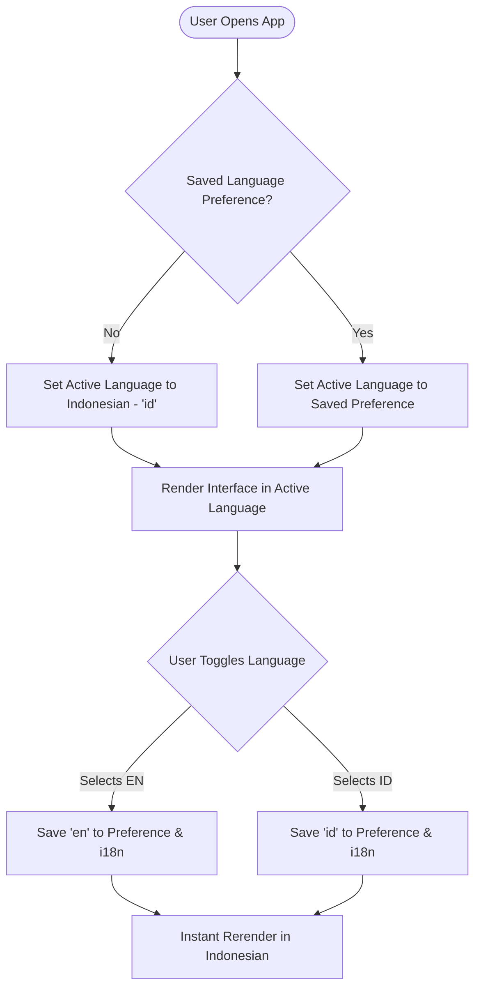
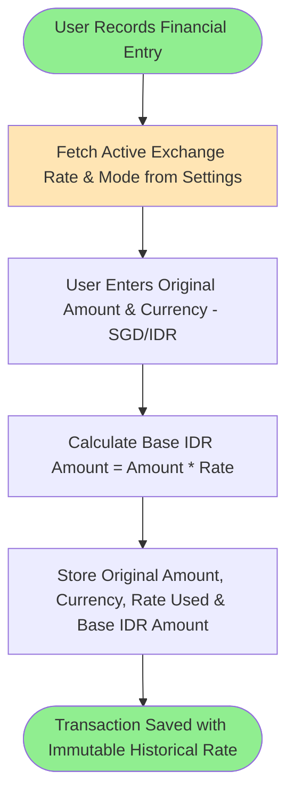

# Feature Specification: Localization & Multi-Currency Management

**Feature Branch**: `002-localization-currency`  
**Created**: 2026-07-24  
**Status**: Draft  
**Input**: Add Localization (ID & EN with ID default), Multi-Currency Management (IDR default & SGD), and Exchange Rate Auto/Manual Sync.

---

## User Scenarios & Testing *(mandatory)*

### User Story 1 - Multi-Language Interface & User Language Preference (Priority: P1)
As any user (Public Visitor or Authenticated User), I want the entire application interface (menus, buttons, labels, validation messages, notifications) to display in my preferred language (Indonesian by default, or English), and have my preference saved in my profile or session, so that I can comfortably interact with the application.

**Why this priority**: Fundamental user experience requirement; sets Indonesian as default language across public and internal portals.

**Independent Test**:
- Open the application as an unauthenticated visitor; verify that all text, headers, and buttons are displayed in Indonesian (Bahasa Indonesia).
- Change language preference to English in the header/settings; verify all UI elements instantly re-render in English.
- Log in as a user, change language to Indonesian, refresh the page/re-log; verify Indonesian preference is persisted.

**Acceptance Scenarios**:
1. **Given** an unauthenticated visitor or new user without saved preferences, **When** they load any page, **Then** the UI renders in Indonesian (`id`).
2. **Given** a user on System Settings or the header language picker, **When** they select "English", **Then** the interface text, toast notifications, validation errors, and table headers update to English without page reload.

---

### User Story 2 - Transaction Currency Selection & Historical Immutable Rates (Priority: P1)
As a Finance Team member or Secretary, I want to select the transaction currency (IDR or SGD) when creating Income, Expense, Internal Payment, or Prize records, so that the transaction stores its original currency, original amount, converted base amount, and the exact exchange rate active at the time of entry.

**Why this priority**: Core financial accuracy; ensures historical transaction data remains immutable regardless of future exchange rate changes.

**Independent Test**: Create an Income record of SGD 100 when the active exchange rate is 1 SGD = 11,800 IDR. Verify that `original_currency: "SGD"`, `original_amount: 100`, `exchange_rate_used: 11800`, and `base_amount_idr: 1180000` are stored. Later, change the active rate to 12,000 IDR and verify that the past record retains its original rate (11,800 IDR) and original base amount.

**Acceptance Scenarios**:
1. **Given** a Finance user recording an expense, **When** they select "SGD" and enter 50.00 with active rate 11,800 IDR, **Then** the system records `amount: 50.00`, `currency: "SGD"`, `exchange_rate_used: 11800`, and `base_amount: 590000`.
2. **Given** historical financial records, **When** the system exchange rate is updated, **Then** historical records retain their original transaction values and rate without recalculation.

---

### User Story 3 - Exchange Rate Auto & Manual Sync Management (Priority: P2)
As an Administrator, I want to manage exchange rates in System Settings using either Manual Mode (manually entering the rate) or Automatic Mode (fetching rates from an external provider with auto-sync and fallback), so that currency conversions are accurate and controllable.

**Why this priority**: Connects live/manual exchange rate updates to transaction entry and dashboard calculations.

**Independent Test**:
- In System Settings, select "Manual Mode", set rate to 11,900 IDR, save, and verify active rate displays "1 SGD = 11,900 IDR (Manual Mode)".
- Switch to "Automatic Mode", trigger manual refresh, and verify the system fetches the rate, updates the active rate, and logs the sync event.
- Simulate an external API network failure; verify the system falls back to the last successful exchange rate cleanly.

**Acceptance Scenarios**:
1. **Given** an Administrator in System Settings, **When** they toggle between "Manual Mode" and "Automatic Mode", **Then** the active rate source and provider status are updated and displayed.
2. **Given** Automatic Mode with an un-syncable network response, **When** auto-sync runs, **Then** the system logs a sync warning and retains the last valid exchange rate.

---

## Requirements *(mandatory)*

### Functional Requirements

- **FR-LOC-001**: System MUST default all UI text, menus, buttons, validation messages, toast notifications, and public views to Indonesian (Bahasa Indonesia).
- **FR-LOC-002**: System MUST support English and Indonesian as built-in localizations, allowing future languages to be added via translation dictionary files (`locales/id.json`, `locales/en.json`) without modifying application logic.
- **FR-LOC-003**: System MUST allow users to switch the active language from the header selector or System Settings, storing user preferences in localStorage (for guests) and user profile settings (for authenticated users).
- **FR-CUR-001**: System MUST set Indonesian Rupiah (IDR) as the default base currency for the application and financial reporting.
- **FR-CUR-002**: System MUST support IDR and SGD for financial records (Income, Expense, Internal Payment, Prize Pool).
- **FR-CUR-003**: Every financial transaction MUST record: `original_amount`, `original_currency`, `exchange_rate_used`, and `base_amount_idr`.
- **FR-CUR-004**: System MUST allow selecting transaction currency (IDR / SGD) when creating or editing financial entries.
- **FR-CUR-005**: Internal Dashboard statistics and totals MUST display values in the selected base currency (IDR by default, with SGD toggle option).
- **FR-CUR-006**: Financial Reports MUST allow filtering and displaying values by: (a) Original Transaction Currency, (b) Converted Base Currency (IDR), or (c) Dual Display (Both).
- **FR-EXC-001**: System MUST support two exchange rate management modes: **Manual Mode** and **Automatic Mode**.
- **FR-EXC-002**: In Manual Mode, Administrators MUST be able to input and save the active exchange rate.
- **FR-EXC-003**: In Automatic Mode, system MUST fetch the latest exchange rate from a trusted provider (e.g. ExchangeRate-API / Bank Indonesia / Open Exchange Rates), support manual refresh by Admin, configurable sync intervals, and fallback to the last successful rate if network fetch fails.
- **FR-EXC-004**: Changing active exchange rates or default currency MUST NEVER recalculate or modify historical transaction records.

---

### Key Entities & Domain Model

- **Language Preference**:
  - Attributes: `user_id`, `language_code` (`id` | `en`), `updated_at`.
- **Exchange Rate Setting**:
  - Attributes: `mode` (`manual` | `auto`), `active_rate_sgd_idr`, `last_successful_sync_at`, `auto_sync_interval_hours`, `provider_name`, `updated_by_user_id`.
- **Financial Transaction (Income / Expense / Payment / Prize)**:
  - Extended Attributes: `amount` (original), `currency` (original: `SGD` | `IDR`), `exchange_rate_used`, `base_amount_idr`.

---

## Success Criteria *(mandatory)*

- **SC-LOC-001**: 100% of UI elements, menu items, validation messages, and toast notifications render accurately in Indonesian when set to `id` and in English when set to `en`.
- **SC-LOC-002**: Switching language completes instantly (< 50ms) without page reload.
- **SC-CUR-001**: 100% of financial entries store original amount, original currency, exchange rate used, and converted base amount.
- **SC-EXC-001**: Historical transaction records preserve original exchange rate and base amount with 0% recalculation drift when global rates update.
- **SC-EXC-002**: Automatic exchange rate sync handles provider failures gracefully by retaining the last valid rate without throwing unhandled exceptions.

---

## Business Process Flow *(visual aid)*

### Language & Currency Preference Flow

### Exchange Rate & Transaction Storage Flow

